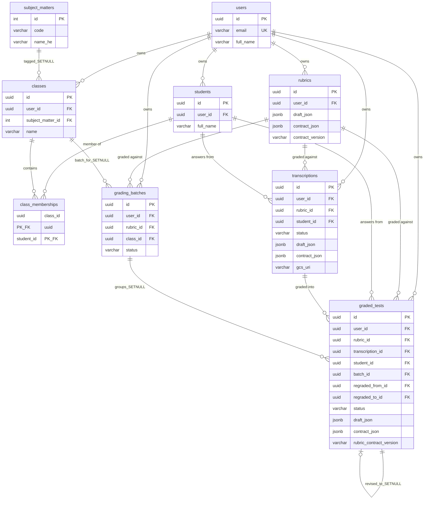
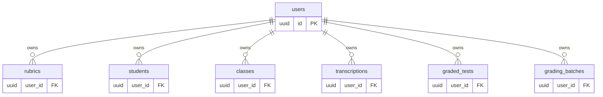
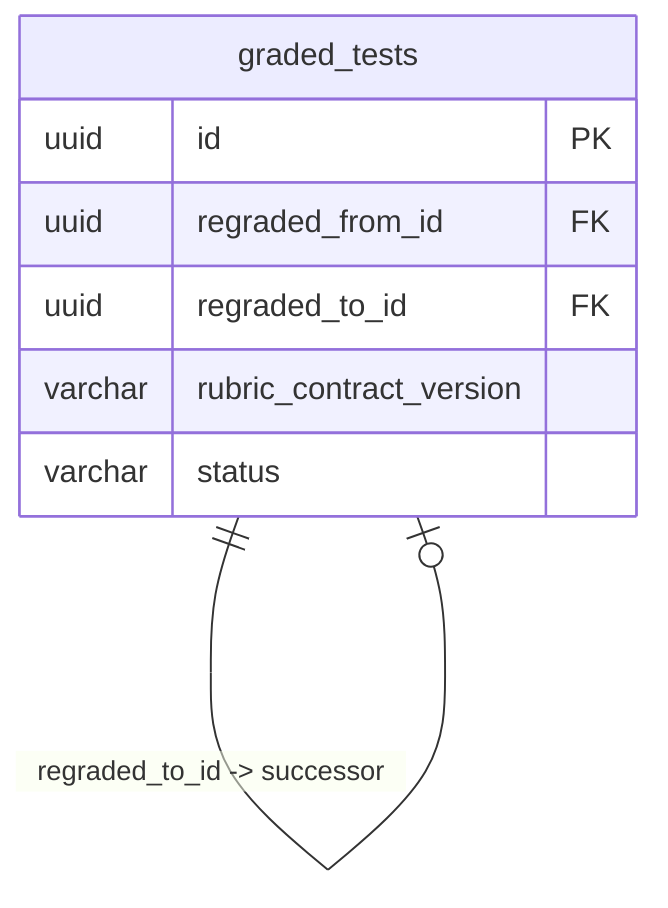

# Vivi — Phase 0d: Entity Relationship Diagram

**Owner:** Noam
**Status:** LOCKED — derived from Phase 0c
**Locked at:** 2026-05-24
**Scope:** Visual cross-check of the grading pipeline schema. Renders the
relationships defined in Phase 0c so we can verify the architecture and the
schema agree.

---

## 0. Purpose

The ERD is **derived, not designed**. Every relationship below is a mechanical
translation of what Phase 0c already specifies. The diagram's value is in what
it makes *visible*: structural patterns, missing relationships, accidental
cycles, lopsided ownership — things that are hard to see in SQL but obvious in
a picture.

If the diagram surfaces something that looks wrong, the answer is to revisit
Phase 0a (architecture) or Phase 0c (schema). Phase 0d itself never introduces
new structure.

**What this document covers:**
1. The main ERD — the full grading pipeline at the table level
2. Ownership view — per-teacher scoping invariant at a glance
3. Revision chain detail — the self-referential FKs on `graded_tests`
4. Legend and reading conventions
5. Cross-checks performed against Phase 0a's invariants
6. What the ERD doesn't show (and where that lives)

---

## 1. Main ERD — the full grading pipeline



### Reading the main ERD

- **Every relationship is CASCADE on delete** unless the label ends in `_SETNULL`.
- **Every entity in the diagram has `user_id`** pointing back to `users`. The ownership invariant from Phase 0a §6.2 is structurally visible: there is no entity in the diagram that isn't owned by a teacher.
- **Rubric is the spine.** Three different artifact tables FK back to `rubrics` — transcriptions reference it ("which rubric am I a transcription against"), graded_tests reference it ("graded against version X"), grading_batches reference it ("this batch grades against rubric Y"). Rubric is the only entity besides `users` with three or more incoming FKs.
- **The artifact chain is two-step:** `transcriptions → graded_tests`. Each step adds new state without mutating the predecessor. (The Draft → Contract step within each artifact is invisible at the ERD level — it's a column-state transition, not a row relationship. See Phase 0a §3 for state machines.)
- **The revision chain is self-referential.** `graded_tests` has FKs back to itself via `regraded_from_id` and `regraded_to_id`. The diagram shows one arc; in reality both directions exist (RGC-2 invariant). Detail in §3.

---

## 2. Ownership view — per-teacher scoping at a glance

The ownership invariant from Phase 0a §6.2 ("the teacher owns all artifacts
created by their actions, and can read/write only their own artifacts") is the
single most important structural property of the schema. The diagram below
isolates it so it's verifiable in one glance.



**Cross-check verified visually:** Six in-scope entities, six `||--o{` lines
from `users`, six `user_id FK` columns. Every entity is owned. No orphans.

`class_memberships` is the only in-scope table without a `user_id` column —
intentionally, because ownership flows through both `classes.user_id` and
`students.user_id` (both must be owned by the same teacher, enforced at the
application layer via the cascade from either side).

---

## 3. Revision chain detail — the self-referential FKs

Phase 0a §3.3 and §9 specify that approved `graded_tests` rows are revised
(never mutated) via two actions — re-grade and manual edit — both of which
extend a linked-list chain via `regraded_from_id` and `regraded_to_id`. RGC-1
through RGC-5 are the invariants.



### Visual semantics of the chain

```
                                          ─── time ───►

    chain head           middle row(s)            chain leaf
   ┌───────────┐         ┌───────────┐          ┌───────────┐
   │   R1      │         │    R2     │          │    R3     │
   │           │         │           │          │           │
   │ regraded_ │  ◄────  │ regraded_ │   ◄────  │ regraded_ │
   │   from = ∅│         │   from=R1 │          │   from=R2 │
   │           │  ────►  │           │   ────►  │           │
   │ regraded_ │         │ regraded_ │          │ regraded_ │
   │   to  =R2 │         │   to  =R3 │          │   to  =∅  │
   └───────────┘         └───────────┘          └───────────┘

      historical            historical              CURRENT
       (frozen)               (frozen)              (active)
```

**Key properties visible from this diagram:**

- The chain head has `regraded_from_id = NULL` (no predecessor).
- The chain leaf has `regraded_to_id = NULL` (no successor — this is the current grade).
- Every other row has both pointers set (RGC-2: bidirectional).
- The chain grows forward only (RGC-3: no cycles).
- All rows in a chain share the same `transcription_id` and `rubric_id` (RGC-4).
- Either re-grade or manual edit can extend the chain (Phase 0a §3.3.1, §3.3.2). They differ in trigger and starting state but not in chain shape.

**The load-bearing constraint:** the partial unique index
`idx_graded_tests_one_leaf_per_chain` on `(transcription_id, rubric_id) WHERE
regraded_to_id IS NULL` enforces RGC-1 — exactly one current leaf per
`(transcription_id, rubric_id)` pair. This index is not visible in the ERD
itself but is the structural guarantee that makes the chain shape sound.

**ON DELETE behavior:** both self-FKs are `SET NULL`, not `CASCADE`. If a row
in the middle of a chain is somehow deleted (admin operation; not a normal
flow), the chain breaks rather than the whole chain getting destroyed. The
audit trail of surviving rows is preserved as much as possible.

---

## 4. Legend

### Cardinality

Mermaid `erDiagram` notation:

| Symbol | Meaning |
|---|---|
| `||--||` | exactly one to exactly one |
| `||--o{` | exactly one to zero-or-many |
| `}o--o{` | zero-or-many to zero-or-many |
| `||--o|` | exactly one to zero-or-one |

### ON DELETE rule

- **Default (no suffix):** `CASCADE`. Parent deletion deletes the child row.
- **`_SETNULL` suffix on the label:** parent deletion sets the FK to NULL; the child survives orphaned with that FK column empty.

The defaults make ownership cascades implicit and SET NULL relationships
visible. The SET NULL cases in this ERD are:

| Relationship | Why SET NULL |
|---|---|
| `classes → grading_batches` | A batch belongs to the teacher, not the class. Deleting a class shouldn't lose the batch's grading record. |
| `grading_batches → graded_tests` | A graded test belongs to the teacher, not the batch (batch is just a grouping label). |
| `subject_matters → classes` | A class belongs to the teacher; the subject tag is metadata. |
| `graded_tests → graded_tests` (self-ref, both directions) | Preserves audit even if a chain neighbor is somehow deleted. |

### Column annotations

- **PK** — primary key
- **FK** — foreign key
- **UK** — unique key
- **PK_FK** — primary key that is also a foreign key (composite PK on join tables)

### What's shown per entity

To keep the diagram readable, each entity shows only:
- The primary key
- All foreign keys
- The `status` column (where one exists) — flags presence of a state machine
- The `draft_json` / `contract_json` columns — flags Draft/Contract pattern presence
- Other shape-defining attributes (e.g., `gcs_uri` on transcriptions, `rubric_contract_version` on graded_tests)

Everything else (timestamps, denormalized fields, observability counters,
soft-state fields like `error_message`) is in Phase 0c and not duplicated here.

---

## 5. Cross-checks performed

These are the visual sanity checks I ran against the main ERD. Each one
verified an architectural invariant from Phase 0a.

| Check | Invariant tested | Result |
|---|---|---|
| Every in-scope entity has an arrow from `users` | IDN-5, OWN-1 (per-teacher scoping) | ✓ Six entities, six ownership arrows |
| `rubrics` is referenced by `transcriptions`, `graded_tests`, and `grading_batches` | The "rubric is the spine" architectural decision | ✓ Three incoming FKs |
| `transcriptions` is referenced by `graded_tests` (not the reverse) | The artifact chain flows one direction (Phase 0a §2.1) | ✓ Single arrow, transcription → graded_test |
| `class_memberships` is a junction table (two FKs, composite PK, no other entities) | Phase 0c §3 — minimum viable M:N | ✓ Two FKs, no extras |
| `graded_tests` has self-referential FKs in both directions | RGC-2 (bidirectional chain) | ✓ Two FK columns, same target table |
| `students` is reachable from both `transcriptions` and `graded_tests` (not just one) | IDN-2 (transcription has student) + denormalized convenience on graded_tests | ✓ Two arrows |
| No table has multiple `user_id` columns | Per-teacher scoping is a single concern | ✓ Each entity has exactly one `user_id` |
| No FK loop between distinct tables | Architectural integrity (no cycles in the dependency graph) | ✓ Only loop is the self-ref on graded_tests, which is intentional |
| `grading_batches.class_id` is FK to `classes`, not VARCHAR | Phase 0c §6 reshape | ✓ Typed as UUID with FK |
| `batch_id` on `graded_tests` is SET NULL (not CASCADE) | Phase 0a §2.2.C — grades survive batch deletion | ✓ Label marked `_SETNULL` |

All checks pass. The ERD agrees with Phase 0a.

---

## 6. What the ERD doesn't show

The ERD operates at the table-and-FK level. Several architectural commitments
live below or beside that level and don't appear in the diagram. Naming them
explicitly so a future reader doesn't mistake omission for absence.

### 6.1 The Draft/Contract pattern inside JSONB

`rubrics`, `transcriptions`, and `graded_tests` all have `draft_json` and
`contract_json` columns visible in the ERD. The actual *shape* of those
JSONB payloads — `ExtractRubricResponse` / `GradingRubricContract` /
`TranscriptionDraft` / `TranscriptionContract` / `GradedTestDraft` /
`GradedTestContract` — lives in `app/schemas/ontology_types.py` (and new
files added in S4 / S6 / S9).

The GraderAgent sprint plan modifies the shapes inside
`rubrics.contract_json` (recursive `sub_criteria`, `extra_notes`, deprecated
`ReductionRule`/`ScoringLevel`). None of those changes are visible in the
ERD — they're column-internal. Phase 0c §4–§5 commit the JSONB columns to
specific Pydantic models by `COMMENT ON COLUMN` annotations.

### 6.2 The `GradableTest` artifact

Per Phase 0a §2.1.B and §8, `GradableTest` is the marriage of
`RubricContract + TranscriptionContract`, in-memory only, never persisted.
It does not appear in the ERD because there is no table for it. The agent
builds it on each grading invocation by reading `rubrics.contract_json` and
`transcriptions.contract_json` and producing a `GradedTestDraft` that lands
in `graded_tests.draft_json`. The full data flow is the subject of Phase 0e.

### 6.3 State machines

Phase 0a §3 specifies lifecycle state machines for transcriptions and
graded_tests. The ERD shows the `status` column but not the valid transitions
between states. State machines live in Phase 0a §3 and are enforced by
CHECK constraints (visible in Phase 0c §4, §5) at the schema level.

### 6.4 Indexes

The ERD shows FKs but not indexes. Phase 0c §1–§6 specify every index
including the load-bearing partial unique index for RGC-1.

### 6.5 Annotations and overlays inside JSONB

`GradingAnnotation` (the unified diagnostic surface per Phase 0a §10) lives
inside `graded_tests.draft_json` and `transcriptions.draft_json`. The ERD
shows the columns; the annotation shape is in the Pydantic models.

Similarly, `TeacherOverride` (Phase 0a §10.4) is a sparse map inside
`graded_tests.draft_json.teacher_overrides` — invisible at the ERD level.

### 6.6 Tables outside the grading pipeline

The following tables exist in the database but are out of scope for this
ERD and are unchanged by the Phase 0 redesign:

| Table | Why omitted |
|---|---|
| `raw_rubrics` | Rubric-side raw artifact. Used by extraction pipeline (upstream). No FKs into the grading pipeline. |
| `rubric_shares` | Rubric sharing infrastructure. Out of scope per Phase 0a §11.2 (cross-teacher sharing of graded tests is not added). |
| `rubric_share_history` | Same. |
| `rubric_share_tokens` | Same. |
| `user_subject_matters` | M:N between users and subject_matters. Tangential — no FK paths into the grading pipeline. |

These tables still exist; the migration didn't touch them; the ERD omits
them for visual clarity. If they need to be visualized for some other
purpose (e.g., a rubric-sharing PR), they get their own diagram.

---

## 7. Quick reference — every FK in the grading pipeline

A flat enumeration for completeness. Every FK from §1 with its full ON DELETE
behavior. Useful for migration auditing and as a checklist.

| FROM table | FROM column | TO table | ON DELETE |
|---|---|---|---|
| `rubrics` | `user_id` | `users` | CASCADE (existing) |
| `students` | `user_id` | `users` | CASCADE |
| `classes` | `user_id` | `users` | CASCADE |
| `classes` | `subject_matter_id` | `subject_matters` | SET NULL |
| `class_memberships` | `class_id` | `classes` | CASCADE |
| `class_memberships` | `student_id` | `students` | CASCADE |
| `transcriptions` | `user_id` | `users` | CASCADE |
| `transcriptions` | `rubric_id` | `rubrics` | CASCADE |
| `transcriptions` | `student_id` | `students` | CASCADE |
| `graded_tests` | `user_id` | `users` | CASCADE |
| `graded_tests` | `rubric_id` | `rubrics` | CASCADE |
| `graded_tests` | `transcription_id` | `transcriptions` | CASCADE |
| `graded_tests` | `student_id` | `students` | CASCADE |
| `graded_tests` | `batch_id` | `grading_batches` | SET NULL |
| `graded_tests` | `regraded_from_id` | `graded_tests` (self) | SET NULL |
| `graded_tests` | `regraded_to_id` | `graded_tests` (self) | SET NULL |
| `grading_batches` | `user_id` | `users` | CASCADE |
| `grading_batches` | `rubric_id` | `rubrics` | CASCADE |
| `grading_batches` | `class_id` | `classes` | SET NULL |

Count: 19 FKs across the grading pipeline. 15 CASCADE, 4 SET NULL.

---

## 8. Next phase

**Phase 0e (DFD)** — the data flow diagram. Tracks one student test through
the full pipeline lifecycle: PDF in → VLM transcription → draft → teacher
review → contract → GradableTest compile → GraderAgent → draft → teacher
edit → contract → approval. Each step annotated with its persistence
location (which table+column) and its trigger (which endpoint or service).

The DFD complements this ERD: where the ERD shows *structural relationships
at rest*, the DFD shows *artifacts in motion*. Together they form the visual
cross-check on the architecture before S0 begins.

After Phase 0e: S0 (cleanup) is already executed; S1 implements migration
008 against the schema this ERD just visualized.
