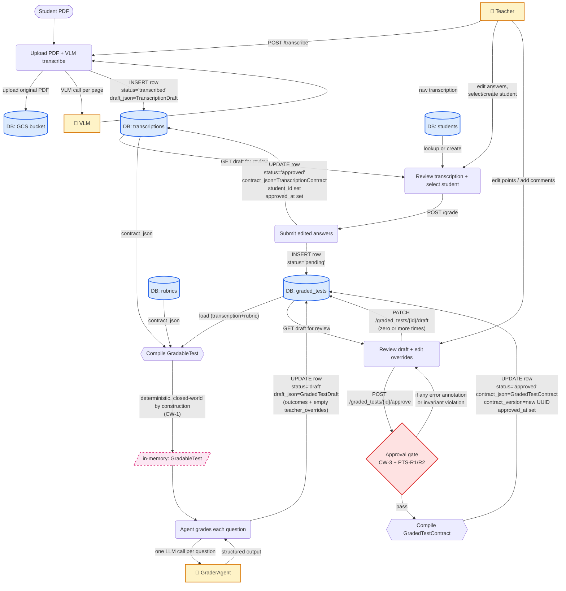
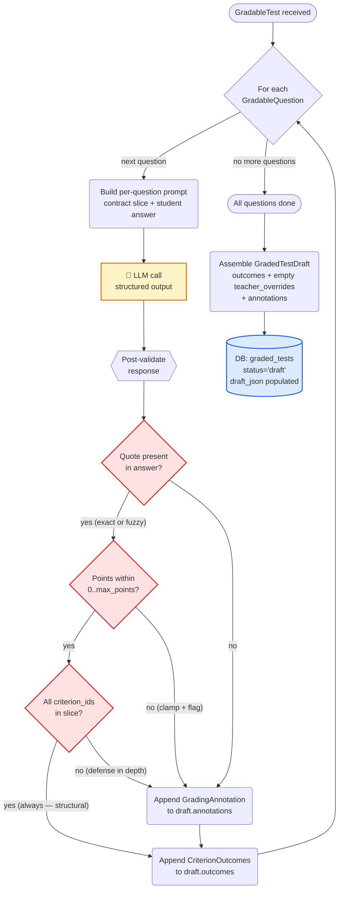
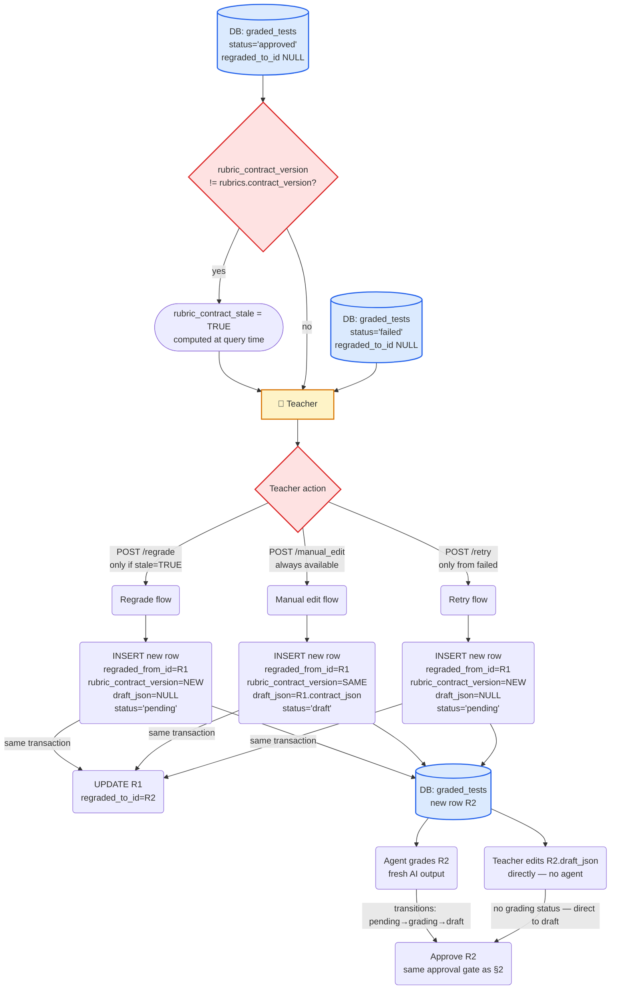

# Vivi — Phase 0e: Data Flow Diagram

**Owner:** Noam
**Status:** LOCKED — derived from Phase 0a (lifecycle), Phase 0c (schema), and the GraderAgent sprint plan
**Locked at:** 2026-05-24
**Scope:** Traces a single student test through the full pipeline. Surfaces the time-axis view that the ERD (static, at-rest) cannot show.

---

## 0. Purpose

The ERD answered: *"what does the data look like at rest?"*
The DFD answers: *"what happens when a teacher uploads a PDF?"*

This document traces an artifact in motion. It locks:
- Every transformation between PDF arrival and approved grade
- Where each transformation persists its output (table + column + Pydantic model)
- Which actor triggers each transition (teacher, VLM, agent, validator)
- Where annotations are produced and what severity they carry
- How revision chains form (re-grade and manual edit)

If a future engineer is debugging *"a graded test got stuck"*, this document tells them which box in the pipeline to look at, with the exact endpoint and table affected.

**What this document covers:**
1. The three actors and their notation
2. End-to-end pipeline — the happy path (PDF in → approved grade out)
3. Inside the GraderAgent — per-question loop and post-validation
4. Revision flows — re-grade and manual edit
5. Annotation production map — where each annotation type originates
6. Persistence boundary map — every flow's landing table+column
7. What the DFD doesn't show (and where it lives)

---

## 1. Actors and notation

Three actors appear in these diagrams:

| Actor | Notation | What they do |
|---|---|---|
| **Teacher** | rectangular box, label `🧑 Teacher` | Uploads PDFs, edits transcriptions, selects students, edits drafts, approves, triggers re-grade / manual edit |
| **VLM** | rectangular box, label `🤖 VLM` | OpenAI vision-language model. Transcribes PDF pages. Stateless. |
| **Agent** | rectangular box, label `🤖 GraderAgent` | The new stupid-simple grader. One LLM call per question. Stateless. |

All other boxes are either:
- **Processes** (rounded rectangles) — pure transformations, no I/O beyond their declared inputs/outputs
- **Data stores** (cylinder shape, prefix `DB:`) — DB tables specified in Phase 0c
- **In-memory artifacts** (dashed rectangles) — exist only for the duration of a single invocation; never persisted (`GradableTest` is the canonical example)
- **Validation gates** (diamond shape) — produce hard errors that block save when failed

Arrows are labeled with:
- The endpoint that triggers the transition (e.g. `POST /transcribe`), OR
- The internal event that triggers it (e.g. `VLM completes`)

---

## 2. End-to-end pipeline — the happy path

A single student test from PDF upload to approved grade. No branching, no revision, no failure.

### Reading the end-to-end pipeline

**Three Draft → Contract promotions, in order:**

1. **TranscriptionDraft → TranscriptionContract.** Trigger: teacher submits edited answers via `POST /grade`. Validates: LCY-1 (status consistency). Hard-block on failure: no, the schema CHECK constraint just refuses the partial state.

2. **(GradableTest compile.)** Not a Draft → Contract event in itself, but a critical waypoint: the in-memory marriage of `RubricContract` + `TranscriptionContract`. Closed-world is enforced *by construction* here — the agent cannot reference IDs not sliced in. CW-1 is structural, not a runtime check.

3. **GradedTestDraft → GradedTestContract.** Trigger: teacher hits approve. Validates: CW-3 (every override references a valid criterion_id) + PTS-R1/R1b/R2 (point sums hold). Hard-block on failure: yes, this is the gate where the teacher must resolve before the contract compiles.

**Three persistence events, in order:**

1. **INSERT `transcriptions`** after VLM completes — draft_json populated, status='transcribed', student_id NULL.
2. **UPDATE `transcriptions`** at submit + **INSERT `graded_tests`** in the same transaction — transcription becomes 'approved'; graded_tests row created with status='pending'.
3. **UPDATE `graded_tests`** at each state transition — pending → grading → draft → approved (or → failed from grading).

The atomic transaction at step 2 means: by the time the next event fires (agent picks up the pending row), both rows are committed. The teacher's submit either succeeds entirely (transcription approved AND graded_tests pending row exists) or fails entirely (no partial state).

**The student is selected during step 2 — the teacher review.** Per Phase 0a RD-4. Before review, `transcriptions.student_id` is NULL (allowed only in 'transcribed' status). After submit, it's set, status flips to 'approved', and the CHECK constraint accepts the row.

---

## 3. Inside the GraderAgent — per-question loop

A zoom into the "Agent grades each question" box from §2. Per the GraderAgent sprint plan: stupid-simple, one LLM call per question, deterministic post-validation.

### Reading the agent loop

**The agent receives a closed-world artifact.** `GradableTest` was compiled by slicing the contract, so any criterion_id the LLM produces *must* be in the slice — there are no other IDs visible to the prompt. The `ClosedWorldCheck` box exists for defense in depth (catching LLM hallucinations that invent IDs from nothing), but in practice it never fires under normal operation. When it does, the annotation severity is `error` and the grade is flagged for teacher review.

**One LLM call per question, not per criterion.** This is the architectural difference from the deprecated TestGraderAgent: that one ran a ReAct loop per criterion (4-5 LLM calls per criterion × 10 criteria per question = 40-50 calls). The new agent: one call per question, all criteria graded in that single call with structured output. For a 10-question test: 10 LLM calls total. Order of magnitude faster, dramatically cheaper.

**Post-validation is deterministic.** Three checks fire on every LLM response, in order:
1. **Quote validation** — every evidence quote must be a substring of the student's transcribed answer (exact match preferred, Levenshtein-distance fuzzy match within 0.15 tolerance accepted). Failure produces a `quote_not_found` annotation.
2. **Bounds enforcement** — every `points_awarded` value must lie in `[0, criterion.points]`. If the LLM proposed an out-of-range value, the agent clamps it and produces a `bounds_violation` annotation.
3. **Closed-world re-check** — every `criterion_id` in the outcomes must appear in the contract slice. Defense in depth.

**Annotations don't block the agent's loop.** Annotations are diagnostic data; the agent appends them to the draft and continues. The save-blocking happens later, at the approval gate (§2), when the teacher tries to finalize a draft that still has `error`-severity annotations.

**When the agent fails unrecoverably** (exception, timeout, infrastructure failure mid-loop), the row transitions to `status='failed'` with `error_message` populated and `draft_json` left NULL or partial. `failed` is terminal for that row — it will never reach `draft` or `approved`. However the chain continues: the teacher can issue `POST /retry` to create a new `pending` successor and rerun the full loop from the start (see §4).

---

## 4. Revision flows — re-grade, manual edit, and retry

Three flows extend an existing `graded_tests` revision chain. All three create a new row, link it back to the previous via `regraded_from_id`/`regraded_to_id`, and produce a new chain leaf. They differ in trigger and starting state. Re-grade and manual edit start from an `approved` row; retry (added S10) starts from a `failed` row.

### Reading the revision flows

**Re-grade vs manual edit vs retry — what differs:**

| Aspect | Re-grade | Manual edit | Retry |
|---|---|---|---|
| Precondition | source row is approved AND `rubric_contract_stale = TRUE` | source row is approved | source row is failed |
| New row's `rubric_contract_version` | NEW (current rubric contract) | SAME as source | NEW (current rubric contract) |
| New row's initial `draft_json` | NULL (fresh AI output incoming) | source's `contract_json` (carried forward) | NULL (fresh AI output incoming) |
| Passes through `'grading'` status | yes | no | yes |
| LLM invoked | yes (full agent loop per §3) | no | yes (full agent loop per §3) |
| Teacher carryover | none — fresh AI grade | full — outcomes + overrides | none — fresh AI grade |

**The shared persistence shape.** All three flows:
1. INSERT a new `graded_tests` row with `regraded_from_id` pointing back.
2. UPDATE the source row's `regraded_to_id` to point forward.
3. Same transaction, both writes commit atomically.

If the transaction fails, neither write applies. RGC-1 (exactly one leaf per `(transcription_id, rubric_id)`) is preserved because the partial unique index would refuse a state with two `regraded_to_id IS NULL` rows for the same pair.

**Both flows converge at the same approval gate.** Whether the new row started from a fresh AI grade (re-grade) or from a carried-forward contract (manual edit), the eventual `POST /approve` runs the same validation: CW-3, PTS-R1/R1b/R2, then compile `GradedTestContract`.

**The `rubric_contract_stale` flag is computed, not stored.** Phase 0a §9.2 — comparing `graded_tests.rubric_contract_version` against `rubrics.contract_version` at query time, no DB column, no trigger. The "stale" box in the diagram is a derived value, not a persisted field.

**Retry from failed (added S10).** `failed` is terminal for the source row — no further transitions on that row are possible, and its `draft_json` remains NULL or partial. The chain, however, is not dead. `POST /retry` is the third revision action: same chain extension mechanics as re-grade (INSERT new `pending` row + UPDATE old row's `regraded_to_id` atomically), uses the current rubric `contract_version`, produces fresh AI output. The new row follows the identical `pending → grading → draft` path the original grading run was supposed to follow. RGC-1 is preserved by the same partial unique index mechanism.

---

## 5. Annotation production map

Every `GradingAnnotation` and `TranscriptionAnnotation` produced in the pipeline has exactly one origin point. Listed below for completeness — useful for debugging "why is this draft flagged" and for testing.

### 5.1 Transcription annotations (live on `transcriptions.draft_json.annotations`)

| Origin step | Annotation type | Severity | `target_id` scope |
|---|---|---|---|
| VLM completion — low confidence on a page | `vlm_uncertainty` | warning | `transcription` (whole) |
| VLM completion — unparseable region | `vlm_unparseable` | warning | `transcription` (whole) |
| VLM completion — missing student name in header | `student_name_missing` | info | `transcription` (whole) |

All transcription annotations are produced once, at VLM completion, and frozen into the draft. They survive into the contract (teacher can choose to acknowledge by submitting anyway; they're not blocking).

### 5.2 Grading annotations (live on `graded_tests.draft_json.annotations`)

| Origin step | Annotation type | Severity | `target_id` scope |
|---|---|---|---|
| Agent — quote validation failed | `quote_not_found` | warning | criterion_id |
| Agent — quote matched only fuzzily | `quote_fuzzy_match` | info | criterion_id |
| Agent — bounds violation (LLM proposed out-of-range points) | `bounds_violation` | warning | criterion_id |
| Agent — closed-world violation (defense in depth) | `closed_world_violation` | error | criterion_id |
| Agent — student answer is empty/missing for this question | `no_answer` | info | question_id |
| Agent — LLM self-reported low confidence | `llm_low_confidence` | warning | criterion_id |
| Approval validator — PTS-R1 violation in proposed contract | `point_sum_question` | error | question_id |
| Approval validator — PTS-R1b violation | `point_sum_sub_question` | error | sub_question_id |
| Approval validator — PTS-R2 violation | `point_sum_criterion` | error | criterion_id |
| Approval validator — teacher override references unknown criterion_id | `closed_world_violation` | error | criterion_id |

**Save-blocking rule (Phase 0a §10.5):**
- Any `error`-severity annotation on a `GradedTestDraft` blocks approval.
- The teacher resolves by editing the override (for closed-world or point-sum issues) or by accepting the underlying grade (for issues from the agent itself that can't be teacher-resolved).
- `warning` and `info` are non-blocking.

**Annotations are produced, never edited.** Phase 0a §10.4 — teachers do not author annotations. Teacher commentary lives in `teacher_overrides[criterion_id].teacher_comment`, a separate semantic.

### 5.3 flags vs. annotations — dual representation by design

`SubCriterionOutcome`, `CriterionOutcome`, and `ScopeOutcome` each carry a `flags: List[FlaggedOutcome]` field alongside `draft.annotations`. This is **not** a parallel ANN-1-governed surface and should not be read as a violation of the single-annotation-surface rule. Two different things serve two different purposes:

| Field | What it is | Who reads it | Governed by |
|---|---|---|---|
| `draft.annotations` | Rolled-up, human-facing diagnostics. One entry per flag event, severity-coded. | Teacher (review UI) | ANN-1 |
| `outcome.flags` | Structured per-outcome data co-located with the criterion it describes. Machine-readable record of the terminal event. | Review UI (per-criterion inline render) + eval suite (E2 per-criterion flag rates) | — (not ANN-1) |

The relationship is explicit in S7 §7.4: the validator produces `FlaggedOutcome` entries per terminal, and each flag event maps to a `GradingAnnotation` in `draft.annotations` via the flag→annotation severity table. The annotation is the rolled-up human-facing entry; the flag is the structured per-outcome datum. The duality is intentional denormalization — analogous to `graded_tests.total_score` (a column) denormalizing what is also computable from `draft_json`.

Stripping `flags` from the outcomes would break two things: (1) per-criterion flag rendering in the review UI (the UI cannot re-derive which specific flag hit which outcome from the rolled-up annotations alone), and (2) the E2 eval suite's per-criterion flag-rate signal.

**ANN-1 governs `draft.annotations` only.** The prohibition on "parallel diagnostic surfaces" is about not scattering teacher-facing review entries across competing collections. `outcome.flags` is outcome-granularity structured data, not a teacher-facing review surface.

---

## 6. Persistence boundary map

Every flow in the diagrams above lands in a specific table+column. Cross-reference for debugging.

| Flow | Landing | Pydantic model | Mutability after write |
|---|---|---|---|
| VLM transcription completes | `transcriptions.draft_json` | `TranscriptionDraft` | Immutable forever |
| Teacher uploads original PDF | `transcriptions.gcs_uri` (+ GCS bucket) | (binary blob) | Immutable forever |
| Teacher submits edited answers | `transcriptions.contract_json` | `TranscriptionContract` | Immutable forever |
| `INSERT graded_tests` pending row | `graded_tests` (status='pending') | (no JSONB yet) | Status mutates only |
| GradableTest compiled | (in-memory only) | `GradableTest` | Garbage collected after agent returns |
| Agent completes grading | `graded_tests.draft_json` | `GradedTestDraft` (outcomes immutable; teacher_overrides mutable) | Outcomes frozen; overrides editable |
| Teacher edits points/comments | `graded_tests.draft_json.teacher_overrides` (sparse map) | `Dict[criterion_id, TeacherOverride]` | Mutable until approval |
| Teacher approves draft | `graded_tests.contract_json` + `contract_version` + `approved_at` | `GradedTestContract` | Immutable forever |
| Re-grade fires | new `graded_tests` row + UPDATE old row's `regraded_to_id` | Same pattern as fresh grade | Same as fresh grade |
| Manual edit fires | new `graded_tests` row (pre-loaded from source contract) + UPDATE old row's `regraded_to_id` | `GradedTestDraft` (initial = previous `GradedTestContract`) | Mutable until approval |
| Retry fires (from failed) | new `graded_tests` row + UPDATE old row's `regraded_to_id` | Same pattern as fresh grade | Same as fresh grade |

---

## 7. What the DFD doesn't show

### 7.1 Failure paths in detail

Each step has a failure mode (VLM call fails, agent crashes mid-question, approval gate rejects). The diagrams sketch the happy path; full failure handling is endpoint-level concern and lands in sprint specs. The schema's `status='failed'` state is the universal escape hatch — any unrecoverable failure transitions the row there with an `error_message` populated. `failed` is terminal for that row (no further state transitions). The chain, however, continues: `POST /retry` (added S10) creates a new `pending` successor by the same chain-extension mechanics as re-grade, allowing the teacher to rerun the full agent loop without losing the revision history. See §4 for the retry flow.

### 7.2 The batch wrapper

Batches are an external grouping concept (Phase 0a §2.2.C). A single test in a batch follows exactly the same pipeline as a standalone test, with `batch_id` set on the `graded_tests` row. The batch's own status is a roll-up of its children's states. The DFD shows the per-test view; the batch dashboard is a separate UX concern over the same data.

### 7.3 Authentication

Every endpoint named in the DFD authenticates the teacher via `Depends(get_current_user)` (Phase 0a §6.3, OD1). The teacher's `user_id` is propagated into every INSERT. This is mandatory infrastructure but tangential to the pipeline's data flow — it gates entry but doesn't transform data.

### 7.4 The teacher's UI screens

The DFD shows logical transitions, not UI screens. The "transcription review screen" in the user's mental model corresponds to the box "Review transcription + select student" in §2 — but how that screen is laid out, what modals appear, what state management lives in the frontend, is sprint-level UX design. The DFD locks: *between these two events, the teacher does these things*, not *here is the screen they see*.

### 7.5 Observability and telemetry

Each grading run records `llm_calls_count`, `grading_duration_ms`, `model_version` on the `graded_tests` row. These are persisted side-effects of the agent's loop but don't drive any decision in the pipeline — they're for offline analysis. Mentioned in §3 as accumulated state but not surfaced as flow events in the diagrams.

### 7.6 The rubric pipeline

Rubrics are upstream of everything in this DFD. By the time the pipeline begins (PDF upload), the rubric's `contract_json` is already populated and version-pinned. The rubric's own Draft → Contract flow is the existing ContractCompiler path — out of scope for this DFD. The GraderAgent sprint adds new fields to the rubric's contract shape (recursive sub_criteria, extra_notes), but that's a contract-internal change invisible at the DFD level.

### 7.7 Annotation rendering

The DFD shows annotations being produced. How they're rendered in the UI (inline next to the criterion, in a top-of-page banner, in a dismissible toast) is UX design. Phase 0a §10.5 locks the save-blocking rule; the rendering is a sprint-S8 concern.

---

## 8. Cross-checks against Phase 0a

Each architectural invariant from Phase 0a §5 should be observably enforced by the DFD's flow. Verification:

| Invariant | DFD verification |
|---|---|
| **IDN-2** — approved transcription has student_id | §2 shows student selection happens during review, before submit. The submit step UPDATEs both `student_id` and `status='approved'` in one transaction. CHECK constraint refuses a partial state. ✓ |
| **IDN-3** — every graded_test has a transcription | §2 shows `graded_tests` INSERT happens in the same transaction as transcription approval. No graded_tests row exists without an approved transcription. ✓ |
| **LCY-1** — approved transcription is read-only | After the submit step in §2, no flow in any diagram writes back to `transcriptions.contract_json`. Re-grade and manual edit (§4) don't touch the transcription. ✓ |
| **LCY-2** — approved/failed graded_test is read-only except `regraded_to_id` | §4 shows the only mutation to an approved row: `UPDATE regraded_to_id = R2` in the revision-flow transaction. Nothing else writes to approved rows. ✓ |
| **CW-1** — closed-world by construction at GradableTest compile | §2's "Compile GradableTest" box is the structural enforcement. The agent in §3 cannot see IDs not sliced in. ✓ |
| **CW-3** — closed-world at approval | §2's approval gate runs CW-3. §3 doesn't enforce CW-3 (the agent has no overrides yet). §4 shows the new row also goes through the same approval gate. ✓ |
| **PTS-R1, R1b, R2** — point sums at approval | §2's approval gate. ✓ |
| **RGC-1** — one leaf per (transcription_id, rubric_id) | §4 shows both revision flows updating the previous row's `regraded_to_id` in the same transaction as the INSERT. Partial unique index refuses any state with two leaves. ✓ |
| **VER-2** — rubric_contract_version pinned at row creation, never mutates | §2 sets it at INSERT. §4 shows re-grade creates a new row with new version; manual edit creates a new row with same version; neither mutates the source row's version. ✓ |
| **ANN-1, ANN-2** — single annotation surface per artifact | §5 lists every annotation origin. All grading annotations land in `graded_tests.draft_json.annotations`; all transcription annotations land in `transcriptions.draft_json.annotations`. No competing teacher-facing surfaces. ✓ (`outcome.flags` is per-outcome structured data for the review UI and eval suite — not a teacher-facing diagnostic surface; see §5.3.) |
| **ANN-3** — teacher does not author annotations | §5 shows every annotation type produced by system actors (VLM, agent, validator). None produced by teacher. Teacher commentary is in `teacher_overrides[].teacher_comment`, a separate field. ✓ |

All Phase 0a invariants verifiable from the DFD. No contradictions.

---

## 9. End of Phase 0

This document completes the Phase 0 foundation:

| Phase | Artifact | Status |
|---|---|---|
| 0a | Architecture lock | Locked |
| 0b | Deletion manifest + migration 007 | Locked, migration executed |
| 0c | Target DDL | Locked, migration 008 written (pending execution) |
| 0d | ERD | Locked |
| 0e | DFD (this document) | Locked |

The architectural foundation is complete. Every artifact has a defined lifecycle, a defined persistence boundary, a defined trigger, and an enforceable invariant set. The schema is specified down to the column. The visual cross-checks (ERD and DFD) agree with the architecture.

**Next: S1 — execute migration 008 + write the new ORM models against the new schema.** From this point forward, every sprint produces code, not specs.
